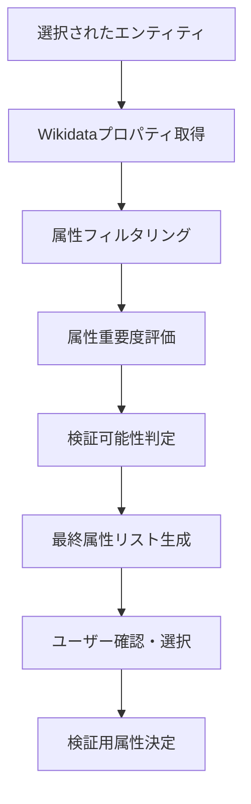

確認属性選定の動作フローについて詳しく説明しますね。これは、選択されたエンティティに対してどの属性（プロパティ）を検証するかを決定する重要なプロセスです。

## 確認属性選定の詳細動作フロー

### 📊 全体フロー概要



### 🔍 各段階の詳細処理

#### **Stage 1: Wikidataプロパティ取得**
```python
# 実装例
def get_entity_properties(entity_id: str) -> Dict:
    """エンティティの全プロパティを取得"""
    
    # Wikidata APIでエンティティ詳細を取得
    url = f"https://www.wikidata.org/wiki/Special:EntityData/{entity_id}.json"
    response = requests.get(url)
    data = response.json()
    
    if entity_id in data['entities']:
        entity_data = data['entities'][entity_id]
        
        properties = {}
        claims = entity_data.get('claims', {})
        
        for property_id, claim_list in claims.items():
            properties[property_id] = {
                'property_id': property_id,
                'values': [],
                'claim_count': len(claim_list)
            }
            
            # 各クレームの値を抽出
            for claim in claim_list:
                if 'mainsnak' in claim:
                    value = extract_claim_value(claim['mainsnak'])
                    if value:
                        properties[property_id]['values'].append(value)
        
        return properties
    
    return {}
```

#### **Stage 2: 属性フィルタリング**
```python
def filter_properties(properties: Dict, entity_type: str) -> Dict:
    """検証対象として適切な属性をフィルタリング"""
    
    # 除外すべきプロパティタイプ
    excluded_properties = {
        'P18',   # 画像
        'P373',  # Commons category  
        'P910',  # トピックの主要カテゴリ
        'P1151', # トピック
        'P1424', # テンプレート
        # ... 画像・メタデータ系プロパティ
    }
    
    # エンティティタイプ別の重要プロパティ定義
    important_properties = {
        'person': {
            'P569': '生年月日',
            'P570': '死没年月日', 
            'P19': '出生地',
            'P27': '国籍',
            'P106': '職業',
            'P26': '配偶者',
            'P22': '父',
            'P25': '母'
        },
        'organization': {
            'P571': '設立年',
            'P159': '本部所在地',
            'P452': '産業',
            'P1128': '従業員数',
            'P2139': '総収入',
            'P112': '創立者',
            'P169': 'CEO'
        },
        'location': {
            'P625': '座標',
            'P1082': '人口',
            'P2046': '面積', 
            'P17': '国',
            'P131': '所在する行政区域',
            'P36': '首都'
        }
    }
    
    filtered = {}
    entity_important = important_properties.get(entity_type, {})
    
    for prop_id, prop_data in properties.items():
        # 除外プロパティをスキップ
        if prop_id in excluded_properties:
            continue
            
        # 値が存在するもののみ
        if not prop_data['values']:
            continue
            
        # 重要度スコアを計算
        importance_score = 0.5  # ベーススコア
        
        if prop_id in entity_important:
            importance_score = 1.0  # 高重要度
            
        prop_data['importance_score'] = importance_score
        filtered[prop_id] = prop_data
    
    return filtered
```

#### **Stage 3: 属性重要度評価**
```python
def evaluate_property_importance(filtered_properties: Dict) -> Dict:
    """属性の重要度を多角的に評価"""
    
    for prop_id, prop_data in filtered_properties.items():
        score = prop_data['importance_score']
        
        # 1. データタイプによる重要度調整
        data_type = get_property_datatype(prop_id)
        type_weights = {
            'time': 1.2,           # 時間データは重要
            'wikibase-item': 1.1,  # エンティティ関連も重要
            'string': 0.9,         # 文字列は中程度
            'quantity': 1.0,       # 数値データ
            'globe-coordinate': 1.1 # 座標データ
        }
        score *= type_weights.get(data_type, 1.0)
        
        # 2. 値の数による調整
        value_count = len(prop_data['values'])
        if value_count == 1:
            score *= 1.1  # 単一値は明確で重要
        elif value_count > 5:
            score *= 0.8  # 多すぎる値は複雑
        
        # 3. プロパティの使用頻度
        usage_frequency = get_property_usage_frequency(prop_id)
        if usage_frequency > 0.7:  # よく使われるプロパティ
            score *= 1.15
        
        # 4. 検証の容易さ
        verification_difficulty = assess_verification_difficulty(prop_id, prop_data['values'])
        score *= verification_difficulty
        
        prop_data['final_score'] = score
    
    return filtered_properties

def assess_verification_difficulty(property_id: str, values: List) -> float:
    """検証の容易さを評価（1.0が最も容易）"""
    
    # プロパティタイプ別の検証容易度
    verification_scores = {
        'P569': 0.9,  # 生年月日 - 比較的検証しやすい
        'P570': 0.9,  # 死没年月日
        'P571': 0.9,  # 設立年
        'P159': 0.8,  # 本部所在地 - やや複雑
        'P27': 0.7,   # 国籍 - 時期により変動の可能性
        'P106': 0.6,  # 職業 - 複数・変化の可能性
        'P26': 0.5,   # 配偶者 - 複雑な関係性
    }
    
    base_score = verification_scores.get(property_id, 0.7)
    
    # 値の複雑さによる調整
    for value in values:
        if isinstance(value, dict):
            # 修飾子付きの複雑な値
            if 'qualifiers' in value:
                base_score *= 0.8
            # 時期限定の値
            if 'time_qualifier' in value:
                base_score *= 0.9
    
    return base_score
```

#### **Stage 4: 検証可能性判定**
```python
def assess_verifiability(properties: Dict) -> Dict:
    """GPTモデルで検証可能かどうかを判定"""
    
    verifiable_properties = {}
    
    for prop_id, prop_data in properties.items():
        # 1. データタイプ別の検証可能性
        data_type = get_property_datatype(prop_id)
        
        verifiable_types = {
            'time': True,           # 日付・時間
            'string': True,         # 文字列
            'wikibase-item': True,  # エンティティ参照
            'quantity': True,       # 数値
            'globe-coordinate': False, # 座標は検証困難
            'commonsMedia': False,  # メディアファイルは除外
            'url': False           # URLは検証対象外
        }
        
        if not verifiable_types.get(data_type, False):
            continue
        
        # 2. 値の具体性チェック
        concrete_values = []
        for value in prop_data['values']:
            if is_concrete_value(value):
                concrete_values.append(value)
        
        if not concrete_values:
            continue
        
        # 3. GPT検証適性スコア
        gpt_suitability = calculate_gpt_suitability(prop_id, concrete_values)
        
        if gpt_suitability > 0.3:  # 閾値以上のもののみ
            prop_data['concrete_values'] = concrete_values
            prop_data['gpt_suitability'] = gpt_suitability
            verifiable_properties[prop_id] = prop_data
    
    return verifiable_properties

def calculate_gpt_suitability(property_id: str, values: List) -> float:
    """GPTでの検証に適しているかのスコア"""
    
    # プロパティ別の基本適性スコア
    base_scores = {
        'P569': 0.9,   # 生年月日 - 非常に適している
        'P570': 0.9,   # 死没年月日
        'P19': 0.8,    # 出生地
        'P571': 0.9,   # 設立年
        'P159': 0.7,   # 本部所在地
        'P27': 0.6,    # 国籍 - 複雑な場合あり
        'P106': 0.5,   # 職業 - 多様で曖昧
        'P452': 0.6,   # 産業
        'P1082': 0.4,  # 人口 - 変動が激しい
    }
    
    score = base_scores.get(property_id, 0.5)
    
    # 値の特性による調整
    for value in values:
        # 日付値の精度
        if 'time' in str(value).lower():
            if 'precision' in str(value):
                precision = extract_time_precision(value)
                if precision >= 9:  # 年単位以上の精度
                    score *= 1.1
        
        # 文字列値の長さ
        if isinstance(value, str):
            if 3 <= len(value) <= 50:  # 適切な長さ
                score *= 1.05
            elif len(value) > 100:     # 長すぎる
                score *= 0.8
    
    return min(score, 1.0)
```

#### **Stage 5: 最終属性リスト生成**
```python
def generate_final_attribute_list(verifiable_properties: Dict, 
                                max_attributes: int = 5) -> List[Dict]:
    """最終的な検証属性リストを生成"""
    
    # スコアでソート
    sorted_properties = sorted(
        verifiable_properties.items(),
        key=lambda x: x[1]['final_score'] * x[1]['gpt_suitability'],
        reverse=True
    )
    
    selected_attributes = []
    
    for prop_id, prop_data in sorted_properties[:max_attributes]:
        # プロパティ名を取得
        property_name = get_property_label(prop_id)
        
        attribute_info = {
            'property_id': prop_id,
            'property_name': property_name,
            'values': prop_data['concrete_values'],
            'importance_score': prop_data['final_score'],
            'verification_suitability': prop_data['gpt_suitability'],
            'data_type': get_property_datatype(prop_id),
            'expected_prompt_type': determine_prompt_type(prop_id)
        }
        
        selected_attributes.append(attribute_info)
    
    return selected_attributes

def determine_prompt_type(property_id: str) -> str:
    """属性に最適なプロンプトタイプを決定"""
    
    prompt_mappings = {
        'P569': 'date_query',      # 「生年月日を教えて」
        'P570': 'date_query',      # 「死没年月日を教えて」
        'P571': 'date_query',      # 「設立年を教えて」
        'P19': 'location_query',   # 「出生地はどこですか」
        'P159': 'location_query',  # 「本部はどこですか」
        'P27': 'identity_query',   # 「国籍は何ですか」
        'P106': 'identity_query',  # 「職業は何ですか」
        'P452': 'category_query',  # 「どの業界ですか」
    }
    
    return prompt_mappings.get(property_id, 'general_query')
```

#### **Stage 6: ユーザー確認・選択インターフェース**
```javascript
// フロントエンド実装例
function displayAttributeSelection(attributes) {
    const container = document.getElementById('attribute-selection');
    
    attributes.forEach((attr, index) => {
        const attributeCard = document.createElement('div');
        attributeCard.className = 'attribute-card';
        attributeCard.innerHTML = `
            <div class="attribute-header">
                <input type="checkbox" id="attr_${attr.property_id}" 
                       checked="${index < 3}"> <!-- 上位3つは自動選択 -->
                <label for="attr_${attr.property_id}">
                    <strong>${attr.property_name}</strong>
                </label>
                <span class="importance-badge">
                    重要度: ${(attr.importance_score * 100).toFixed(0)}%
                </span>
            </div>
            <div class="attribute-details">
                <p><strong>現在の値:</strong> ${formatValues(attr.values)}</p>
                <p><strong>検証適性:</strong> ${getVerificationSuitabilityText(attr.verification_suitability)}</p>
                <p><strong>質問タイプ:</strong> ${getPromptTypeText(attr.expected_prompt_type)}</p>
            </div>
        `;
        
        container.appendChild(attributeCard);
    });
}

function formatValues(values) {
    return values.slice(0, 3).map(value => {
        if (typeof value === 'object' && value.value) {
            return value.value;
        }
        return String(value).substring(0, 50);
    }).join(', ') + (values.length > 3 ? '...' : '');
}
```

### 📊 実際の選定例

#### **例: マツダ株式会社 (Q35794) の場合**

1. **取得された全プロパティ**: 約50個
2. **フィルタリング後**: 15個（画像・メタデータ除外）
3. **重要度評価後の上位属性**:
   ```
   P571: 設立年 (1920年) - スコア: 0.95
   P159: 本部所在地 (広島県) - スコア: 0.88
   P452: 産業 (自動車製造) - スコア: 0.82
   P112: 創立者 (松田重次郎) - スコア: 0.78
   P1128: 従業員数 (約49,000人) - スコア: 0.65
   ```

4. **最終選定**: 上位3-5個を検証対象として決定

### 🔧 システム設定可能パラメータ

- **max_attributes**: 最大検証属性数（デフォルト: 5）
- **importance_threshold**: 重要度最低閾値（デフォルト: 0.3）
- **verification_threshold**: 検証適性最低閾値（デフォルト: 0.3）
- **auto_select_count**: 自動選択する上位属性数（デフォルト: 3）

この属性選定プロセスにより、エンティティごとに最も適切で検証可能な属性が自動的に選ばれ、効率的なファクト検証が実現されます。
